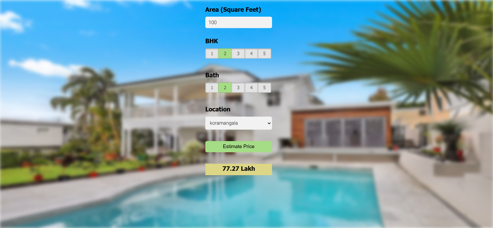

# Predict-House-Prices

A website to predict house prices in Bengaluru.

## How to run

  1. Clone this repository.
  2. Install the requirements using the command `pip install -r requirements.txt`
  3. Go to the [server](./server/) folder.
  4. Open your terminal and run the command ```python server.py```
  5. Now open app.html in the [client](./client/) folder.
  
The dataset was obtained from kaggle. You can find the dataset [here](./Bengaluru_House_Data.csv) in this repository or alternatively,
you can get it from [kaggle](https://www.kaggle.com/amitabhajoy/bengaluru-house-price-data)


